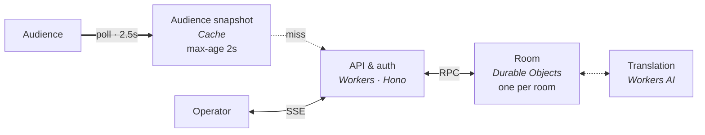

# Live Q&A

<picture>
  <source media="(prefers-color-scheme: dark)" srcset="branding/default/banner-dark.svg">
  
</picture>

Self-hosted live Q&A for conferences, with built-in translation.

https://github.com/user-attachments/assets/1b96f529-1491-4bd0-a8c7-cebdb9ead759

- The audience scans a QR code, asks and upvotes from their phones. No account.
- Operators review questions, put one on the stage screen, mark it answered.
- Questions are translated as they arrive.
- Runs on your own Cloudflare account.



## Deploy

Needs a Cloudflare account, Node 24 and pnpm.

```bash
pnpm install
pnpm exec wrangler login
export CLOUDFLARE_ACCOUNT_ID=...   # pnpm exec wrangler whoami lists them
pnpm run deploy                    # creates the database, prints the url
```

Secrets, once. At least one sign-in provider; the callbacks are `<origin>/auth/google` and `<origin>/auth/github`.

```bash
pnpm exec wrangler secret put SESSION_SECRET       # any long random string
pnpm exec wrangler secret put ADMIN_EMAILS         # comma separated; these accounts create rooms
pnpm exec wrangler secret put GOOGLE_CLIENT_ID
pnpm exec wrangler secret put GOOGLE_CLIENT_SECRET
pnpm exec wrangler secret put GITHUB_CLIENT_ID
pnpm exec wrangler secret put GITHUB_CLIENT_SECRET
```

Translation is set in the `vars` of [wrangler.jsonc](wrangler.jsonc): model, languages, free-form context. An empty `TRANSLATION_MODEL` turns it off.

Branding: copy `branding/default`, edit the title, colours, banner and icon, deploy with `BRANDING=<folder> pnpm run deploy`. `branding/pek2026` is an example.

Own domain: `DOMAIN=qa.example.com pnpm run deploy`, for a zone on the same account. Cloudflare sets up DNS and TLS and turns the workers.dev url off.

## Usage

| Who | Opens | Does |
| --- | --- | --- |
| Admin | `/` → **Host** | creates the room and names its operators. The name is the link and the QR code: `/r/example` |
| Operator | `/r/example/admin` | shows, hides, puts on the stage, marks answered |
| Operator | `/r/example/present` | on the projector: QR code, address, top questions by votes |
| Audience | `/r/example` | asks, anonymously or under their name; upvotes |

Admins can do everything an operator can. The gear on the admin and present screens opens the room's settings:

| Setting | Does |
| --- | --- |
| **Accepting questions** | off closes the room between talks: the list stays up, votes still count, nothing new comes in |
| **Review before showing** | holds new questions until an operator releases them |
| **Next talk** | archives every question, so the screens start empty for the next speaker |
| **Notice** | one line on the audience and stage screens: "Q&A starts at 14:00" |
| **Translation shown** | headline, full or none, on this screen only |
| **Export** | downloads every question, archived ones included, with votes, status and translation, as CSV |
| **Operators** | admins name who may run the room |
| **Delete this room** | admins only; takes every question with it |

## Develop

```bash
cp .dev.vars.example .dev.vars   # fill in what you need
pnpm run migrate
pnpm dev                          # http://localhost:5173
pnpm test
pnpm run demo                     # records the tour into demo/out
```

Translation calls the real Workers AI even locally: `wrangler login` first, or leave `TRANSLATION_MODEL` empty. `pnpm run load` runs a k6 audience against `BASE_URL`.

## License

MIT
