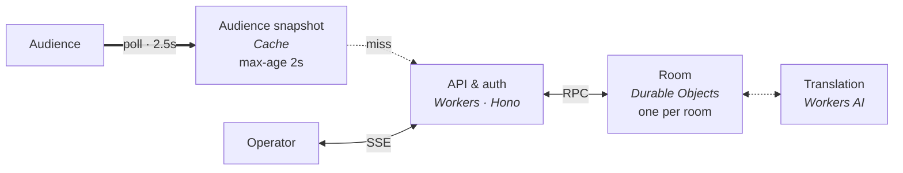

# Live Q&A

<picture>
  <source media="(prefers-color-scheme: dark)" srcset="branding/default/banner-dark.svg">
  
</picture>

Self-hosted live Q&A for conferences, with built-in translation.

```mermaid
flowchart LR
  aud["Audience"] -->|"poll · 2.5s"| cache["Audience snapshot<br/><i>Cache</i><br/>max-age 2s"]
  cache -.->|"miss"| worker["API & auth<br/><i>Workers · Hono</i>"]
  ops["Operator"] <-->|"SSE"| worker
  worker <-->|"RPC"| room["Room<br/><i>Durable Objects</i><br/>one per room"]
  room <-.-> ai["Translation<br/><i>Workers AI</i>"]
  linkStyle 0 stroke-width:3px
```
